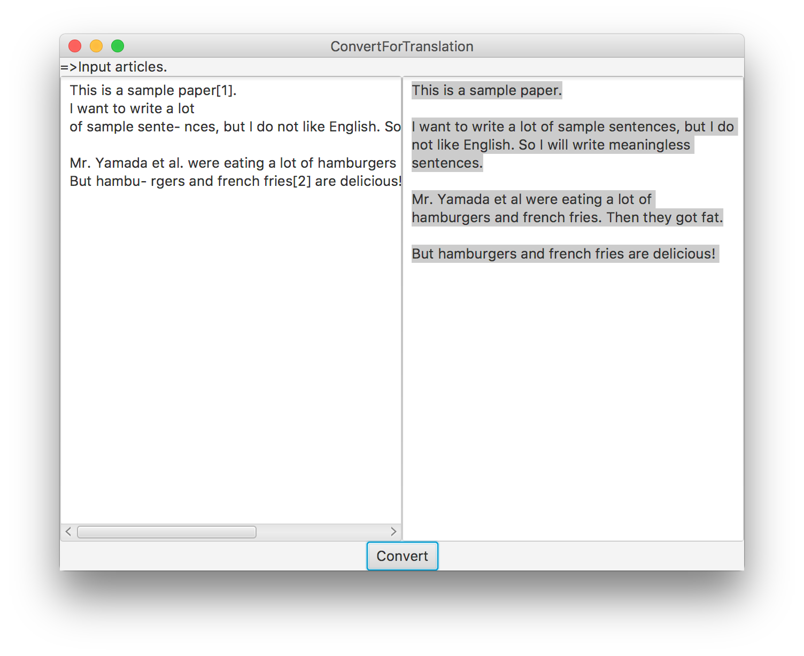

# Convert For Translation

PDF形式の論文の文章をコピーしてGoogle翻訳にぶちこんでも、改行とか引用とかが邪魔でうまく翻訳してくれない、、、という問題を解決するためのツール。

## Description
PDF形式の英語論文をGoogle翻訳で翻訳したい時に、コピペしても余分な改行とか引用番号とかが入っててうまく翻訳してくれない
→そういう翻訳時にいらない部分を除去したい

完全に自分用に作ったけど、せっかく作ったのでもし使う人がいたらと思ってあげときます。

いまのところ
* PDF形式特有の不要な改行を除去
* [1][2]などの引用番号を除去←図番号とかがこの形式で書かれてるとそれも除去されちゃうから注意
* 単語の途中で改行された時にハイフンで繋ぐやつを修復
* 「et al.」のピリオドを除去
* 段落ごとに改行して分ける

## Usage
1. フォルダごとzipでダウンロード
2. ターミナル等を起動
3. (ダウンロードした場所)/(ダウンロードしたファイル)/src に移動
4. (初回のみ)  
`javac com/Yusuke/java/ConvertForTranslationApp.java`  
`javac com/Yusuke/java/WindowController.java`  
を入力してコンパイル  
5.  `java com.Yusuke.java.ConvertForTranslationApp`  
で起動

6. 左のテキストエリアに翻訳したい論文の文章をコピペ
7. 下のConvertボタンを押す
8. 右のテキストエリアに変換後の文章が表示されるとともに、**クリップボードにコピーされる**
9. そのままGoogle翻訳へ！

